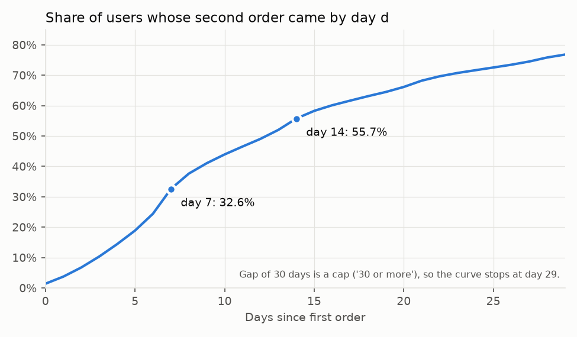
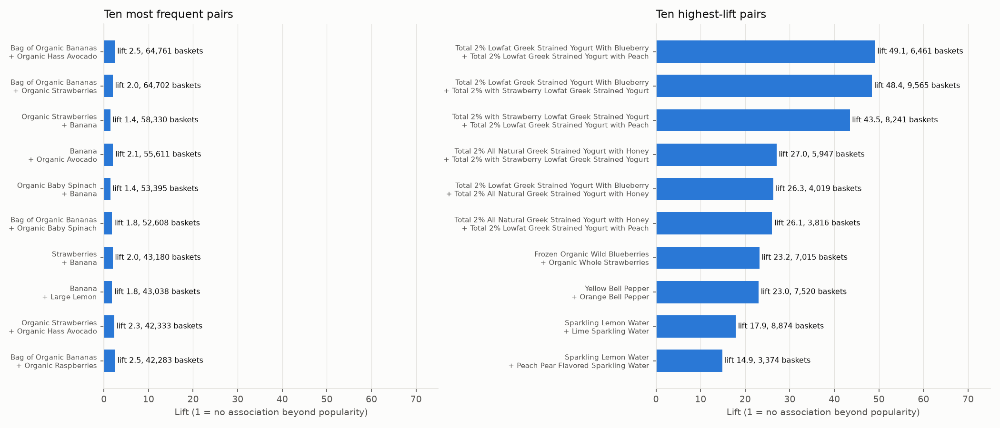

# Instacart customer behavior: funnel, retention and a simulated A/B test

This project asks how Instacart customers keep ordering after their first order, which parts of the catalog are bought out of habit, and how an experiment on a reorder reminder would be sized and analysed. The analysis is written in SQL (DuckDB) with Python for the statistics. The only simulated part is the A/B test, because the dataset contains no experiment.

In short: about 56% of customers place a second order within 14 days of their first, and the share who have returned jumps at day 7, which suggests a weekly shopping habit. Reorder rates range from 71% in dairy and eggs to 34% in personal care. The most frequent product pairs are just the most popular products, and ranking by lift instead surfaces substitutes such as flavors of one yogurt brand. The A/B test is simulated, and its job is to show that the sizing and analysis code is correct when the true effect is known. A one-page proposal is in [reports/recommendation.md](reports/recommendation.md), and [notebooks/analysis.ipynb](notebooks/analysis.ipynb) walks through the results with charts.





## Data

The data is the Instacart Online Grocery Shopping Dataset 2017, as published for the Kaggle competition "Instacart Market Basket Analysis". I did not redistribute it. To run the project, download the six files (orders, order_products__prior, order_products__train, products, aisles, departments) from Kaggle into `data/raw/`, and read the dataset's terms of use on the Kaggle competition page and on Instacart's dataset page first.

It has 206,209 users, 3,421,083 orders and about 33.8 million order line items over 49,688 products. It has no calendar dates and no prices. The only time information is `order_number`, `order_dow`, `order_hour_of_day` and `days_since_prior_order`, which is capped at 30. Every user has between 4 and 100 orders, and 75,000 of the final orders are labelled `test` and have no line items. Full integrity checks are in `docs/validation.csv`, and all pass.

Because of this, time is measured from each user's own first order. A user's day offset is the running sum of `days_since_prior_order`. A recorded gap of 30 means "30 or more days", so offsets are lower bounds for users with long gaps. About 10.8% of orders carry that cap. There are no calendar cohorts here, no seasonality and no revenue. Precise definitions are in `docs/metric_definitions.md` and the assumptions are in `docs/assumptions.md`.

## Method

The SQL files in `sql/` run in order: load, validation, user timeline (`ROW_NUMBER`, `SUM OVER` and `LAG`), funnel, retention, reorder rate by category, basket affinity, and the inputs for the A/B simulation. Each analysis query starts with a comment giving the business question, the definition and the edge cases. `src/run_sql.py` runs them and writes the result tables to `reports/tables/`. Minimum-support thresholds (10,000 line items for categories, 1,000 users for retention segments, 20,000 baskets per product and 500 per pair for affinity) are set in that file. I chose them to avoid noisy rates and did not tune them.

The tests in `tests/` check the SQL against independent pandas calculations on a small randomly generated dataset in the same format, check that validation notices a broken key, and check the statistics against statsmodels and a textbook example.

## Results

All numbers below come from the result tables in `reports/tables/`.

**Funnel.** Everyone reaches orders 2 and 3 because the sample only contains users with at least 4 orders. 88.4% of users reach order 5 and 53.7% reach order 10. The median user reaches order 2 at day 13, order 5 at day 57 and order 10 at day 106.

**Retention.** 32.6% of users place a second order within 7 days of the first and 55.7% within 14 days. At least 76.8% do so within 30 days (gap under 30), and the other 23.2% sit at the capped value, so 30-day retention is only bounded from below. The share who have returned rises sharply into day 7 (24.4% at day 6, 32.6% at day 7), consistent with weekly shopping. By first basket size, the 1-5 item group returns least within 14 days (52.9%) and the 6-10 item group most (57.2%). By the department that dominates the first basket, household (47.0%) and personal care (49.2%) are lowest and babies and alcohol are highest, among departments with at least 1,000 users. These are associations, not effects. Of all users, 74.7% still order at or after day 90 and 41.8% at or after day 180.

**Reorder rate.** Among line items in orders after the first, dairy eggs (71.2%), beverages (69.5%) and produce (69.1%) have the highest reorder rates, and personal care (34.5%) and pantry (37.2%) the lowest. By aisle, milk is highest (82.7%) and spices and seasonings lowest (16.4%). Six small aisles fall below the support threshold and are flagged in the table.

**Basket affinity.** The most frequent pairs are bananas, avocados, strawberries and spinach, with lifts of 1.4 to 2.5, because these products are in so many baskets that they appear together often by chance. Ranking by lift instead surfaces flavors of one Greek yogurt line (lifts 43 to 49) and sparkling waters. Those are substitutes that people buy several of in one order, so high lift here reflects variety buying, not a cross-sell opportunity. The charts are in `reports/`, and `notebooks/analysis.ipynb` walks through them.

## Simulated A/B test

Nothing in this section comes from a real experiment. The design and the decision rule were written down before running anything, in `docs/ab_test_design.md`. The hypothetical intervention is a reorder reminder after the first order. The primary metric is the 14-day reorder rate, with a real baseline of 55.7%, and the guardrail is the number of items in the second order. In each simulation, real users are randomly assigned 50/50, and for treated users a known lift is injected on top of their real outcome.

With alpha 0.05 and 80% power, a 2 percentage point lift needs 9,632 users per arm. Using all 206,209 users would detect about 0.61 points. In 2,000 repeated runs with a true 2 point effect, the test detected it in 80.1% of runs, the mean estimate was 1.99 points, and the 95% interval covered the true value in 94.8%. In 2,000 A/A runs the false positive rate was 4.35% (Monte Carlo standard error 0.46 points). With an injected drop of 1 item in treated basket size, the decision rule blocked shipping in all 2,000 runs. When I dropped 5% of treated users after assignment to mimic a logging bug, the sample ratio check at p < 0.001 flagged it in only 58.8% of runs, so it is not sensitive to a loss that small at this sample size. The ship decision requires both the primary test and the guardrail to pass, which is why no multiple-comparison correction is applied to alpha. The reasoning is in the design document.

The injected effect size (2 points) and the guardrail margin (0.5 items) are assumptions of mine.

## Limitations

There are no calendar dates, so there is no seasonality, trend or cohort analysis, and every duration is time since a user's own first order. Gaps are capped at 30 days, which makes 30-day retention a lower bound and understates long timelines. Every user has at least 4 orders, so retention and funnel figures describe customers who stayed, not everyone who placed a first order. Orders labelled `test` have no products, so they count in the funnel and timeline but not in basket analysis. There are no prices, so there is no revenue or basket value, only item counts. The category and basket results are associations and do not show that products cause return behavior. Product variants are separate products, for example "Banana" and "Bag of Organic Bananas", which affects pair rankings. The A/B test is a simulation on real baseline outcomes, so it validates the analysis code and sizing method, not the effect of any reminder. The guardrail metric exists only for users who reordered, which makes the two arms differ in composition in a real test. On production data I would add real timestamps, use calendar cohorts, check for novelty effects and handle users who share accounts.

## Reproduce

Python 3.11 is required. Put the six CSV files in `data/raw/`, then:

```bash
make setup
make sql
make ab
make charts
make notebook
make test
```

`make sql` builds `data/instacart.duckdb` and writes the tables. `make ab` runs the simulation with seed 42, and package versions are pinned in `requirements.txt`. The tests use generated data, not the real files.

## Contact

From [Yashasvi Jaiswal](https://yashjswl.com).

LinkedIn: [linkedin.com/in/yashjswl](https://www.linkedin.com/in/yashjswl/)

Email: [hello@yashjswl.com](mailto:hello@yashjswl.com)

---

&copy; 2026 Yashasvi Jaiswal. All rights reserved.
